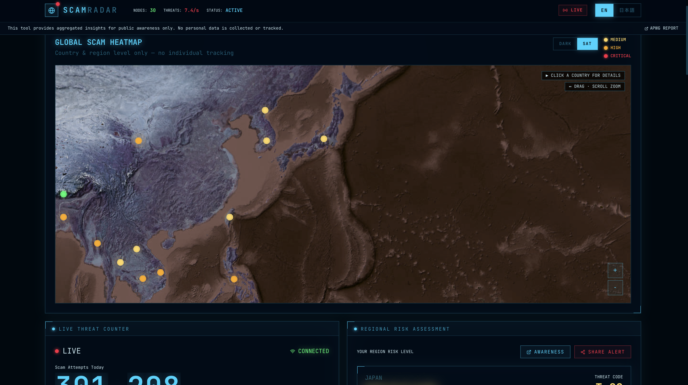

# ScamRadar 🛡️

リアルタイム詐欺脅威インテリジェンスダッシュボード。世界中の詐欺活動をサイバーパンク風UIで可視化します。

    

---

## 概要

ScamRadar は、世界175カ国の詐欺活動をリアルタイムで監視・分析するダッシュボードです。バックエンド不要のフルクライアントサイドアプリとして動作し、ブラウザ上またはiOSアプリとして実行できます。

### 主な機能

- **リアルタイムカウンター** — 毎秒更新される詐欺試行数（SMS・フィッシング・偽電話）
- **インタラクティブ世界地図** — 175カ国の脅威レベルをリアルタイムでマップ表示（ダーク/衛星切替対応）
- **国別詳細レポート** — クリックで詐欺種別の内訳・YoY変化・過去6ヶ月のトレンドを表示
- **大規模トレンド分析** — 24ヶ月分の歴史データを複数グラフタイプで分析（エリア/バー/ライン/レーダー）
- **ライブフィード** — 最新の詐欺キャンペーン情報を30秒ごと更新
- **リスクスコア** — ユーザーの地域に応じた個人リスク評価
- **多言語対応** — 日本語・英語切替（i18next）
- **iOS対応** — Capacitorによるネイティブアプリ化・PWA対応

---

## スクリーンショット



> ダークモードのサイバーパンク風UIで世界の詐欺脅威を一目で把握できます。

---

## 技術スタック

| カテゴリ | 技術 |
|---|---|
| フロントエンド | React 18 + TypeScript + Vite |
| 地図 | Leaflet.js（CartoDB Dark / ESRI衛星） |
| グラフ | Recharts（Area / Bar / Line / Radar） |
| アニメーション | Framer Motion |
| 状態管理 | Zustand |
| 国際化 | i18next |
| モバイル | Capacitor（iOS） + PWA |
| データ | クライアントサイドシミュレーション（サーバー不要） |

---

## セットアップ

### 必要環境

- Node.js 18以上
- npm 9以上
- （iOSビルドの場合）Xcode 15以上 + CocoaPods

### インストール

```bash
git clone https://github.com/kuramichi2010/scam-radar.git
cd scam-radar/frontend
npm install
```

### 開発サーバー起動

```bash
npm run dev
```

ブラウザで `http://localhost:5174` を開きます。

### プロダクションビルド

```bash
npm run build
```

---

## iOSアプリとしてビルド

```bash
cd frontend

# ビルド & Capacitor同期
npm run build
npx cap sync ios

# Xcodeで開く
npx cap open ios
```

Xcode上で実機またはシミュレーターにビルドします。

### ライブリロード（WiFi経由）

開発中はiPhoneから直接開発サーバーに接続することでホットリロードが使えます。

```bash
# MacのIPアドレスを確認
ipconfig getifaddr en0

# Capacitor設定のURLを更新して sync
CAPACITOR_SERVER_URL=http://<MacのIP>:5174 npx cap sync ios
```

---

## プロジェクト構成

```
scam-radar/
├── frontend/
│   ├── src/
│   │   ├── components/
│   │   │   ├── WorldHeatMap.tsx      # インタラクティブ世界地図
│   │   │   ├── CountryDrawer.tsx     # 国別詳細ドロワー
│   │   │   ├── TrendAnalysisPanel.tsx # 大規模トレンド分析
│   │   │   ├── LiveFeed.tsx          # ライブ脅威フィード
│   │   │   └── ...
│   │   ├── utils/
│   │   │   ├── simulation.ts         # クライアントサイドデータ生成（175カ国）
│   │   │   └── historyUtils.ts       # 歴史データ生成（決定論的シード乱数）
│   │   ├── store/scamStore.ts        # Zustand グローバルストア
│   │   ├── hooks/useScamData.ts      # データ初期化・ライブ更新フック
│   │   └── i18n/                     # 日本語・英語翻訳
│   ├── ios/                          # Capacitor iOSプロジェクト
│   ├── public/
│   │   ├── manifest.json             # PWAマニフェスト
│   │   └── icon.svg                  # アプリアイコン
│   └── capacitor.config.ts
└── backend/                          # Python FastAPI（オプション・現在未使用）
```

---

## 脅威レベル定義

| レベル | 色 | リスクスコア |
|---|---|---|
| CRITICAL | 赤 | 75以上 |
| HIGH | オレンジ | 60〜74 |
| MEDIUM | 黄 | 45〜59 |
| LOW | 緑 | 45未満 |

---

## 注意事項

本アプリのデータはシミュレーションによって生成されたものです。実際の詐欺統計とは異なります。教育・デモ目的のみでご使用ください。

---

## ライセンス

MIT License
